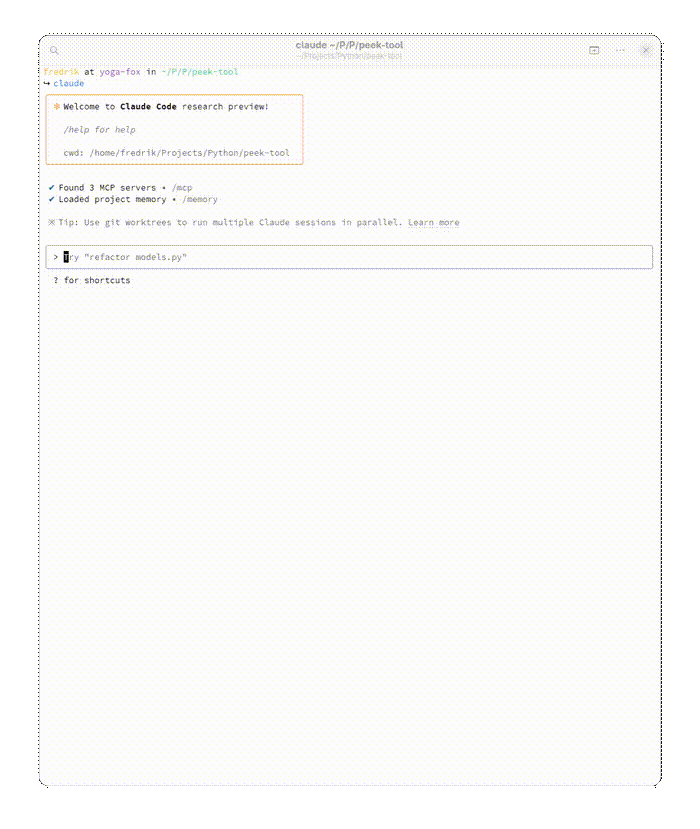

<div align="center">
  <h1>Peek</h1>
  <p>🔍 Python module inspection and API discovery tool</p>
  
  [](https://www.python.org/downloads/)
  [](https://opensource.org/licenses/MIT)
</div>

---

## ✨ Why Peek?

Navigating complex Python libraries shouldn't be painful. **Peek** is a developer tool for API discovery that helps you:

- **Understand Python modules quickly** through structured inspection
- **Explore APIs efficiently** with hierarchical navigation
- **Extract method signatures** with complete type annotations
- **Integrate with LLMs** through MCP server capabilities

## 🚀 Quick Start

```bash
# Install as a development dependency with uv
uv add --dev git+https://github.com/angelsen/peek-tool.git

# Start exploring any Python module
uv run peek requests
```

Connect with your favorite AI tools:
- 🤖 [Claude Desktop integration](#with-claude-desktop)
- 💻 [Claude Code integration](#with-claude-code)  
- 🖱️ [Cursor integration](#with-cursor)

<div align="center">  
  <div id="demo-animation">
    
  </div>
</div>

## 🌟 Key Features

- **Comprehensive API Discovery** - Quickly explore and understand any Python module, class, or method
- **Type-Aware Analysis** - View detailed parameter and return types from annotations
- **JSON Navigation** - Parse and traverse complex JSON structures with path-based queries
- **LLM Integration** - Supercharge AI assistants with Python introspection capabilities
- **Developer-Friendly** - Clean, concise output tailored to your current context

## 🔧 Usage Examples

### Command Line

```bash
# Inspect a Python module
uv run peek json

# Inspect a specific class
uv run peek json.JSONEncoder

# Inspect a specific method
uv run peek json.JSONEncoder.encode

# Inspect a JSON file
uv run peek path/to/your/file.json

# Inspect a specific element in a JSON file
uv run peek path/to/your/file.json:path.to.element
```

## 📦 Installation

### From GitHub

```bash
# Install as a development dependency
uv add --dev git+https://github.com/angelsen/peek-tool.git
```

### Development Setup

```bash
# Clone the repository
git clone https://github.com/angelsen/peek-tool.git
cd peek-tool

# Install dependencies
uv sync

# Install in development mode
uv add --dev --editable .
```

## 🔮 MCP Integration

Peek can supercharge your AI coding workflows by connecting to leading AI tools through MCP (Model Context Protocol).

### Starting the MCP Server

```bash
# Start the MCP server
uv run peek-mcp

# With custom options
uv run peek-mcp --name "My Peek Server" --transport sse
```

### With Claude Desktop

Add to your Claude Desktop config:

1. Install [Claude Desktop](https://claude.ai/download) if you haven't already
2. Open the Claude menu and select "Settings..."
3. Click on "Developer" in the left sidebar, then click "Edit Config"
4. Add the Peek server to your configuration:

```json
{
  "mcpServers": {
    "peek": {
      "command": "uv",
      "args": ["run", "peek-mcp"],
      "env": {}
    }
  }
}
```

5. Save the file and restart Claude Desktop

### With Claude Code

```bash
# Add Peek MCP server to current project (local scope)
claude mcp add peek -- uv run peek-mcp

# Or add it globally (available in all projects)
claude mcp add peek -s user -- uv run peek-mcp

# List configured MCP servers
claude mcp list
```

### With Cursor

1. For project-specific configuration, create a `.cursor/mcp.json` file in your project directory
2. For global configuration, create a `~/.cursor/mcp.json` file in your home directory
3. Add the following configuration:

```json
{
  "mcpServers": {
    "peek": {
      "command": "uv",
      "args": ["run", "peek-mcp"],
      "env": {}
    }
  }
}
```

4. Restart Cursor, and Peek will be available to use from the AI assistant

## 🛠️ Project Structure

```
peek-tool/
├── src/
│   └── peek_tool/
│       ├── __init__.py        # Package exports
│       ├── core/              # Core inspection functionality 
│       │   ├── base.py        # Abstract base classes
│       │   └── python_inspector.py # Python module inspection
│       ├── formatters/        # Output formatters
│       │   ├── base.py        # Formatter interface
│       │   └── text.py        # Text formatter
│       ├── models/            # Data models
│       │   ├── api_element.py # Models for API elements
│       │   └── inspection_result.py # Inspection results
│       ├── mcp_server/        # MCP server package
│       │   ├── __init__.py    # Package marker
│       │   ├── __main__.py    # Entry point
│       │   ├── tools.py       # MCP tools
│       │   ├── resources.py   # MCP resources
│       │   └── prompts.py     # MCP prompts
│       └── cli.py             # Command-line interface
├── tests/                     # Test suite (coming soon)
└── README.md
```

## 🗺️ Roadmap

- Enhanced OpenAPI (Swagger) inspection
- Additional output formats (Markdown)
- Filtering options (e.g., `--no-private` to hide private methods)
- Depth control for adjusting verbosity level
- Interactive navigation mode
- Source code view with syntax highlighting
- Enhanced MCP integration with additional tools and resources
- Web UI for browsing inspection results

## 📜 License

MIT License